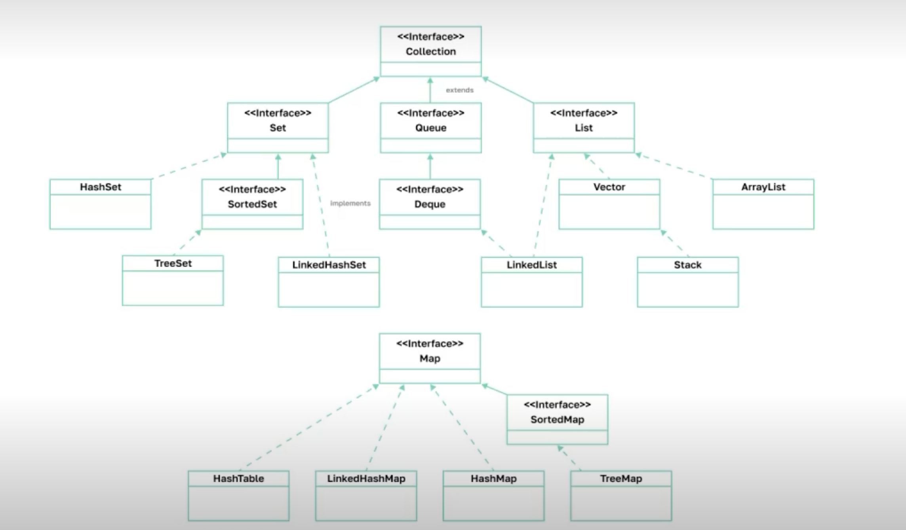

# Коллекции List

## ArrayList

Позволяет хранить пронумерованный набо из элементов. Этот тип данных по своему поведению очень похож на массивы.
```java
import java.util.ArrayList;

public class Main {

    public static void main(String[] args) {
        ArrayList<String> list = new ArrayList<>();
        list.add("Petya");
        list.add("Olya");
        list.add("Tanya");
        System.out.println(list);  // [Petya, Olya, Tanya]
        System.out.println(list.size());  // 3
        list.set(0, "Kolya");
        System.out.println(list);  // [Kolya, Olya, Tanya]
        System.out.println(list.get(1));  // Olya
        list.add(1, "Pasha");
        System.out.println(list);  // [Kolya, Pasha, Olya, Tanya]

        System.out.println(list.contains("Olya"));
    }
}
```
- `import java.util.ArrayList;` - обязательно нужно заимпортировать!
- `ArrayList<String> list = new ArrayList<>();` - является дженерик классом (здесь указываем тип данных его элементов, здесчь можем указать только ссылочный тип данных, например вместо int - Integer (его ссылочный аналог) )
- главное отличие от массивов - он может менять свое количество ячеек

В самом начале создается пустой список, из 0 ячеек. Если мы хотим добавить новый элемент - воспользуемся add `list.add("Petya");`. Также есть методы гет, сайз, контэинз. ArrayList по сути умеет все то же самое, что и массив - но еще и может добавлять себе в конец элементы (или добавлять по индексу).

Зачем нам тогда массивы? ArrayList реализован через массив и работает достаточно быстро. Мы почти всегда можем заменить использование массива ArrayList-ом. Одним особенным случаем будет то что ArrayList использует только ссылочный тип данных.

Класс ArrayList — это реализацией списка на основе динамически расширяемого массива. Такую реализацию следует применять, если в процессе работы с коллекцией предполагается частое обращение к элементам по индексу. ArrayList очень эффективно использует память и операции, основанные на доступе по индексу: сортировка, перемешивание, бинарный поиск и т. д. — выполняются быстро. Но этой коллекции рекомендуется избегать, если требуется частое удаление/добавление элементов в середину коллекции

Разница между массивом и ArrayList
1. Размер - У массивов в Java фиксированный размер. ArrayList имеет динамически расширяемый размер. При добавлении элементов фактически происходит перераспределение памяти — создание нового массива и копирование в него элементов из старого массива
2. Типы данных - Массив может содержать и примитивы и объекты. Но ArrayList не может содержать в себе данные с примитивным типом. Он может содержать только объекты
3. Iterator - Для перебора элементов в ArrayList используется объект Iterator. Для перебора элементов  в массиве используется цикл for
4. Безопасность типов - Java обеспечивает безопасность типов, используя Generics. Массив может содержать только объекты одного и того же типа. Если мы попробуем добавить в массив объект производного типа, то получим ArrayStoreException
5. Длина - Размер ArrayList может быть получен с помощью метода size(). Каждый массив имеет поле length, которое означает длину массива
6. Добавление элементов - В ArrayList мы можем использовать метод add() для добавления объектов. В массиве добавление элементов невозможно
7. Многомерность - Массив может быть многомерным. ArrayList всегда одномерен

ArrayList имеет следующие конструкторы:
- ArrayList() — создаёт пустой список
- ArrayList(Collection <? extends E> col) — создаёт список, в который добавляются все элементы коллекции col
- ArrayList (int capacity) — создаёт список, который имеет начальную ёмкость capacity  
Ёмкость в ArrayList представляет размер массива, который будет использоваться для хранения объектов. Изначальное задание ёмкости ArrayList позволяет снизить перераспределение памяти в процессе расширения, тем самым повышая производительность

Помимо методов интерфейса Collection интерфейс List имеет собственные методы:
- E get(int index): возвращает объект из списка по индексу index
- int indexOf(Object obj): возвращает индекс первого вхождения объекта obj в список. Если объект не найден, то возвращается -1
- int lastIndexOf(Object obj) — возвращает индекс последнего вхождения объекта obj в список. Если объект не найден, то возвращается -1
- ListIterator listIterator () — возвращает объект ListIterator для обхода элементов списка
- E set(int index, E obj) — присваивает значение объекта obj элементу, который находится по индексу index
- List subList(int start, int end) — получает набор элементов, которые находятся в списке между индексами start и end

## Иерархия коллекций и итераторы

Создадим ArrayList `ArrayList<String> list = new ArrayList<>();`. Когда мы создаем список, все, что мы хотим - чтобы он вел себя как список - чтобы это был пронумерованный набор из элементов. Нас не особо волнует, как реализован и устроен внутри ArrayList и как Джава обеспечивает работу этих методов. Именно поэтому в джаве существует целая иерархия типов для разных наборов.



Грубо говоря, коллекции - это просто набор из элементов. Сейчас мы создали объект класса ArrayList - это коллекция пронумерованных элементов в джаве. Однако в джаве существует специальный интрефейс, который объединяет все коллекции такого типажа (по сути, все коллекции, которые содержат в себе пронумерованный набор из элементов). В джаве существует несколько реализаций этого интерфейса и ArrayList - лишь один из них.
- Vector - старая реализация этого интерфейса, уже не используется тк очень медленный
- LinkedList - построен на других принципах и отличается от ArrayList по скорости работы на некоторых операциях.

List (или просто списки) не является единестенным типом коллекций в джаве. Например, иногда нам вообще не важен порядок элементов, нам важен набор элементов как набор вообще (важно, что элемент именно находится, а какой он по счету - не важно). Для этого используется интерфейс Set.

Объединяет же все типы коллекций в джаве единый интерфейс Collection. Особняком стоят ассоциативные массивы - их объединяет интерфейс Map.

Интерфейс Collection предоставляет сигнатуры основных методов работы с простыми последовательными  наборами элементов: 
- add() 
- addAll() - чтобы передать коллекции какую нибудь другую коллекцию 
- clear() 
- contains() 
- containsAll() 
- equals()
- hashCode() - он есть у всех объектов в джаве
- isEmpty()
- iterator() - отдает объект итератора чтобы мы могли пройтись по коллекции
- remove()
- removeAll()
- size()
- toArray() - конвертирует нашу коллекцию в массив

Главными в иерархии коллекций из пакета java.util являются два интерфейса: Collection и Map. Эти интерфейсы делят все коллекции по типу хранения данных на два вида: простые последовательные наборы элементов и наборы пар «ключ-значение» (словарь или ассоциативный массив)

Интерфейс Collection расширяют три интерфейса: Set, Queue, List.
- Интерфейс Set представляет собой неупорядоченную коллекцию, не содержащую одинаковых элементов. Из-за неупорядоченности элементы множества нельзя получить по их индексу, поэтому для множеств невозможны перемешивание элементов и сортировка. Однако при этом операции проверки на наличие элемента во множестве эффективнее, чем в списке. Такая коллекция будет полезна, если необходимо не допускать дубликатов объектов в коллекции и не нужен порядок хранения элементов.
- Интерфейс Queue описывает коллекции с предопределённым порядком вставки в очередь  и извлечения элементов из очереди. Эта структура данных используется, например, для хранения списка задач, в приложениях,  в которых особенно важно исполнение всех задач из списка и существует определенный порядок исполнения. Существуют реализации: однонаправленная очередь — FIFO (first-in-first-out), работающая по принципу «первый вошёл — первый вышел», и двунаправленная очередь (интерфейс Deque). Помимо методов интерфейса Collection определяет дополнительные методы для извлечения  и добавления элементов в очередь: offer(), peek(), poll(). 
- Интерфейс List — один из наиболее часто используемых интерфейсов коллекций, который обозначает упорядоченную коллекцию. Каждый элемент списка имеет целочисленный индекс, по которому возможно добавление и удаление элементов. Этот интерфейс также предоставляет специальный итератор ListIterator, который позволяет перемещаться по списку в обе стороны и вставлять новые элементы. Такой интерфейс определяет следующие методы: get(), indexOf(), lastIndexOf(), listIterator(), set(), subList(). 

Для перебора элементов коллекции (особенно когда она не пронумерована) есть механизм итератора

```java
import java.util.ArrayList;
import java.util.Iterator;
import java.util.List;

public class Main {

    public static void main(String[] args) {
        List<String> list = new ArrayList<>();  // ArrayList нужен лишь при создании списка, объявлять лучше как List
        list.add("Petya");
        list.add("Olya");
        list.add("Tanya");

        for (int i = 0; i < list.size(); i++) {
            System.out.println(list.get(i));
        }

        for (String s : list) {
            System.out.println(s);
        }
    }
}
```
Итератор - это объект, который знает, как внутри устроена коллекция. Этот объект передает сама коллекция, когда мы вызываем у нее метод iterator. Объект Iterator умеет отвечать на 3 вопроса
- next() - есть ли что еще посмотреть?
- hasNext() - дай мне следующий элемент, который я еще не видел. если мы посмотрели все элементы и нечего смотреть - возникнет исключение NoSuchElementException
- remove - удаляет из коллекции последний просмотренный элемент  
Причем мы не можем менять коллекцию не через итератор пока мы используем итератор - иначе итератор заметит что мы поменяли коллекцию каким то обходным путем и, скорее всего, умрет.
```java
public interface Iterator <E>{
    E next();
    boolean hasNext();
    void remove();
}
```
В коде это будет выглядеть так
```java
        Iterator<String> iterator = list.iterator();  // Iterator - дженерик интерфейс!
        while (iterator.hasNext()) {
            String s = iterator.next();
            System.out.println(s);
        }
```
Это универсальный способ и он работает всегда (для обхода всей коллекции). Даже если коллекция запрещает нам смотреть структуру.

Нам не обязательно всегда использовать итератор. For each работает на этом типе данных (внутри себя использует итератор!)

Использовать Iterator нужно в случае, если необходимо в процессе перебора содержимого удалять элементы, иначе, если использовать обычный цикл for, получите ConcurrentModificationException. Также его рекомендуется использовать, если необходима уверенность, что не будет произведена попытка доступа к элементу по неправильному индексу и не будет получен NullPointerException

## LinkedList

Базовая идея ArrayList - он внутри себя хранит массив. Если мы пытаемся добавить еще один элемент - ArrayList понимает, что массив внутри не может добавить внутрь себя ячейку (в массиве можно изменять только значения ячеек - нельзя добавлять новые ячейки или удалять их). Поэтому он создает рядом еще один массив на 1 ячейку больше и добавляет все туда. Это может выглядеть как медленное решение. Однако ArrayList испольтзует несколько оптимизаций - например, он добавляет ячеек сразу с запасом. Такие идеи позволяют работать ArrayList-у достаточно быстро. Основные операции get и set работают быстро тк  не зависят от длины массива. Операция add - иногда будет работать долго (когда запаса нет и приходится копировать массив), иногда - быстро (когда запас есть). В реальности в среднем добавление элементолв в конец списка вообще не зависит от его размера. Однако если добавлять новую ячейку в середину или в начало - то джаве придется двигать много элементов. Так что добавление в конец работает быстро, добавление в начало - медленно. То же самое и с remove. 

LinkedList (связанный список) работает на других принципах. Он не использует внутри себя массивы. По сути, он для каждого элемента создает ячейку и в ней уже хранит нужные данные (значение и своих соседей - предыдущую и следуюущую ячейки). При добавлении/удалении объекта - нам это сделать легко, достаточно просто пройти по перекрестным ссылкам и поменять адреса ячеек.

Однако, другие операции (гет, сет) у LinkedList работают достаточно долго. Для гет сначала нужно определиться, к какому концу ближе ячейка (ближе к началу или ближе к концу). LinkedList сразу не может прыгнуть в ячейку, тк нет ссылки на нее - приходится идти по всем элементам.

Еще преимущество ArrayList - бежать по массиву гораздо быстрее чем бежать по ссылкам. Массив можно представить как просто последовательность ячеек, которые лежат рядом в павмяти. В LinkedList ячейки же могут лежать вообще в разных метсах в куче.

Чаще всего используется ArrayList, но если нужны особенности LinkedList (пройтись по LinkedList и удалить какие то значения, или же добавить элемент в начало) - можно пользоваться им. 